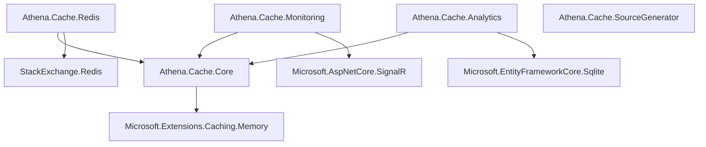

# Installation

Athena.Cache provides multiple packages to fit different needs. Install only what you need for your application.

## Core Package (Required)

All applications need the core package which provides basic caching functionality with MemoryCache.

```bash
dotnet add package Athena.Cache.Core
```

This package includes:
- Attribute-based caching (`[AthenaCache]`, `[CacheInvalidateOn]`)
- Automatic cache key generation
- MemoryCache provider
- Table-based invalidation
- Zero-memory optimizations

## Additional Packages (Optional)

### Redis Distributed Caching

For distributed caching across multiple application instances:

```bash
dotnet add package Athena.Cache.Redis
```

**When to use:** Multi-instance deployments, microservices, load-balanced applications.

### Source Generator (Compile-time Optimization)

For maximum performance and AOT support:

```bash
dotnet add package Athena.Cache.SourceGenerator
```

**When to use:** High-performance applications, AOT compilation, large-scale deployments.

**Note:** Add this to your **application project** (the one with controllers), not library projects.

### Monitoring & Alerting

For real-time monitoring and alerting:

```bash
dotnet add package Athena.Cache.Monitoring
```

**When to use:** Production environments where you need visibility into cache performance.

### Analytics & Insights

For advanced usage analytics and optimization insights:

```bash
dotnet add package Athena.Cache.Analytics
```

**When to use:** When you need detailed usage patterns and performance optimization recommendations.

## Quick Setup Examples

### Basic Setup (MemoryCache Only)

```bash
# Install core package
dotnet add package Athena.Cache.Core
```

```csharp
// Program.cs
using Athena.Cache.Core.Extensions;

var builder = WebApplication.CreateBuilder(args);

// Add Athena Cache
builder.Services.AddAthenaCacheComplete(options => {
    options.Namespace = "MyApp";
    options.DefaultExpirationMinutes = 30;
});

var app = builder.Build();

// Add middleware
app.UseRouting();
app.UseAthenaCache();
app.MapControllers();

app.Run();
```

### Production Setup (Redis + Monitoring)

```bash
# Install packages
dotnet add package Athena.Cache.Core
dotnet add package Athena.Cache.Redis
dotnet add package Athena.Cache.Monitoring
dotnet add package Athena.Cache.SourceGenerator
```

```csharp
// Program.cs
using Athena.Cache.Core.Extensions;
using Athena.Cache.Redis.Extensions;
using Athena.Cache.Monitoring.Extensions;

var builder = WebApplication.CreateBuilder(args);

// Add Redis-based caching
builder.Services.AddAthenaCacheRedisComplete(
    athenaOptions => {
        athenaOptions.Namespace = "MyApp_Prod";
        athenaOptions.DefaultExpirationMinutes = 60;
        athenaOptions.Logging.LogCacheHitMiss = true;
    },
    redisOptions => {
        redisOptions.ConnectionString = builder.Configuration.GetConnectionString("Redis");
        redisOptions.DatabaseId = 1;
        redisOptions.InstanceName = "MyApp";
    });

// Add monitoring
builder.Services.AddAthenaCacheMonitoring(options => {
    options.MetricsCollectionInterval = TimeSpan.FromSeconds(30);
    options.EnableSignalRAlerts = true;
});

// Add SignalR for real-time monitoring
builder.Services.AddSignalR();

var app = builder.Build();

// Configure middleware
app.UseRouting();
app.UseAthenaCache();
app.UseAthenaCacheAnalytics();
app.MapHub<CacheMonitoringHub>("/monitoring-hub");
app.MapControllers();

app.Run();
```

## Package Dependencies



## Framework Requirements

- **.NET 8.0** or later
- **ASP.NET Core** (for web applications)
- **Redis 6.0+** (for distributed caching)

## Configuration Files

### appsettings.json Example

```json
{
  "ConnectionStrings": {
    "Redis": "localhost:6379"
  },
  "AthenaCache": {
    "Namespace": "MyApp",
    "DefaultExpirationMinutes": 30,
    "Convention": {
      "EnableConventionBasedInvalidation": true
    },
    "ErrorHandling": {
      "OnCacheError": "LogAndContinue"
    },
    "Logging": {
      "LogCacheHitMiss": true,
      "LogCacheInvalidation": true
    }
  },
  "RedisCacheOptions": {
    "ConnectionString": "localhost:6379",
    "DatabaseId": 1,
    "InstanceName": "MyApp",
    "ConnectTimeout": 5000,
    "SyncTimeout": 1000
  }
}
```

### Using Configuration

```csharp
// Program.cs
builder.Services.AddAthenaCacheRedisComplete(
    builder.Configuration.GetSection("AthenaCache"),
    builder.Configuration.GetSection("RedisCacheOptions"));
```

## Verification

After installation, verify everything is working:

```csharp
[ApiController]
[Route("api/test")]
public class TestController : ControllerBase
{
    [HttpGet]
    [AthenaCache(ExpirationMinutes = 1)]
    public IActionResult Test()
    {
        return Ok(new { 
            Message = "Cache is working!", 
            Timestamp = DateTime.UtcNow 
        });
    }
}
```

Call the endpoint twice - the second call should return the cached response (same timestamp) and include the header `X-Athena-Cache: HIT`.

## Next Steps

- **[Learn the Basics]({{ site.baseurl }}/getting-started/basics)** - Understand core concepts
- **[Cache Key Generation]({{ site.baseurl }}/fundamentals/cache-key-generation)** - How cache keys work
- **[Redis Setup]({{ site.baseurl }}/distributed/redis-setup)** - Configure distributed caching

## Troubleshooting

### Common Issues

**Package restore fails**
```bash
# Clear NuGet cache
dotnet nuget locals all --clear
dotnet restore
```

**Source Generator not working**
- Ensure you added it to the **application project**, not a library
- Rebuild the solution after adding the package

**Redis connection issues**
- Verify Redis server is running
- Check connection string format
- Ensure firewall allows connection

Need help? Check our [Troubleshooting Guide]({{ site.baseurl }}/advanced/troubleshooting) or [open an issue](https://github.com/jhbrunoK/Athena.Cache/issues).